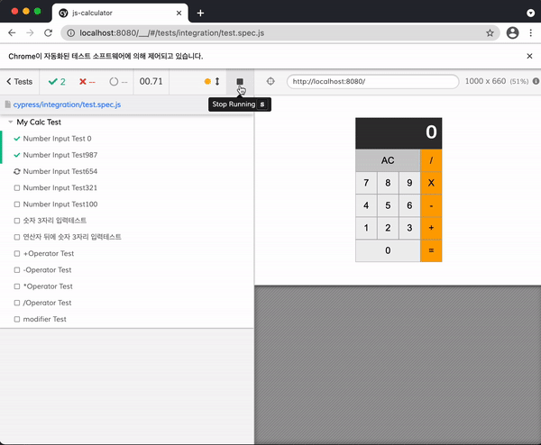

# 계산기에 Cypress테스트 해보기

## 🎯 기능 요구사항

- [x] 2개의 숫자에 대해 덧셈이 가능하다.
- [x] 2개의 숫자에 대해 뺄셈이 가능하다.
- [x] 2개의 숫자에 대해 곱셈이 가능하다.
- [x] 2개의 숫자에 대해 나눗셈이 가능하다.
- [x] AC(All Clear)버튼을 누르면 0으로 초기화 한다.
- [x] 숫자는 한번에 최대 3자리 수까지 입력 가능하다.
- [x] 계산 결과를 표현할 때 소수점 이하는 버림한다.

### 테스트 사항

src/js/index.js에 계산기 기능 구현
- Number Input Test 0 : 초기상태일 때는 0을 여러번 입력해도 0
- Number Input Test987 : 987 버튼의 작동상태 확인
- Number Input Test654 : 654 버튼의 작동상태 확인
- Number Input Test321 : 321 버튼의 작동상태 확인
- Number Input Test100 : 100 버튼의 작동상태 확인
- 숫자 3자리 입력 테스트 : 숫자는 최대 3자리까지 입력가능 9999 -> 999
- 연산자 뒤에 숫자 3자리 입력테스트 : 연산자 뒤에도 최대 3자리까지 가능 9999+9999 -> 999+999
- Operator Test : 각각의 연산자에 대한 테스트
- modifier Test : AC버튼을 눌렀을 때 초기화 확인

-----

 
 

  

<h2 align="middle">level1 - 자바스크립트 계산기</h2>

자바스크립트 계산기로 익혀보는 Cypress

  
  
  
  
  

## 🔥 Projects!

  

  <a href="https://next-step.github.io/js-calculator/">🖥️ 데모 링크</a>

## 🎯 기능 요구사항

- [ ] 2개의 숫자에 대해 덧셈이 가능하다.
- [ ] 2개의 숫자에 대해 뺄셈이 가능하다.
- [ ] 2개의 숫자에 대해 곱셈이 가능하다.
- [ ] 2개의 숫자에 대해 나눗셈이 가능하다.
- [ ] AC(All Clear)버튼을 누르면 0으로 초기화 한다.
- [ ] 숫자는 한번에 최대 3자리 수까지 입력 가능하다.
- [ ] 계산 결과를 표현할 때 소수점 이하는 버림한다.

 

## 📊 테스트 요구사항

**기능 요구사항에 제시된 7개의 항목에 대해 테스트 케이스를 만든다.**

 

## 📄 참고 사항
* 숫자 입력은 **클릭**으로만 가능하다.

 

## 👏 Contributing
만약 미션 수행 중에 개선사항이 보인다면, 언제든 자유롭게 PR을 보내주세요. 

 

## 🐞 Bug Report
버그를 발견한다면, [Issues](https://github.com/next-step/js-calculator/issues) 에 등록 후 @eastjun에게 dm을 보내주세요.

 

## 📝 License
This project is [MIT](https://github.com/next-step/js-calculator/blob/master/LICENSE) licensed.
