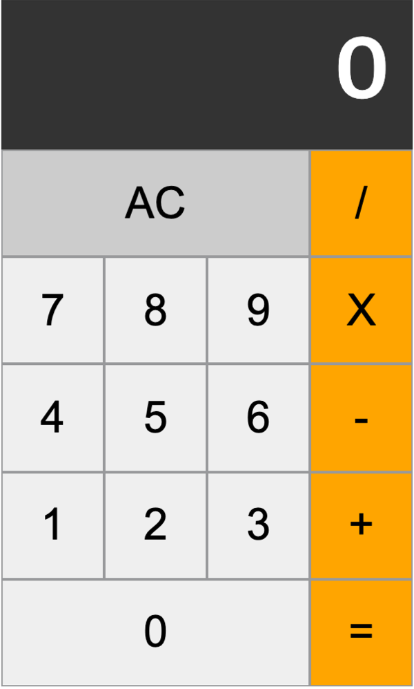

<br/>
<br/>

<p align="middle" >
  
</p>
<h2 align="middle">level1 - 자바스크립트 계산기</h2>
<p align="middle">자바스크립트 계산기로 익혀보는 Cypress</p>
<p align="middle">
  
  
  
  
  
</p>

## 🔥 Projects!

<p align="middle">
  
</p>

<p align="middle">
  <a href="https://next-step.github.io/js-calculator/">🖥️ 데모 링크</a>
</p>

## 🎯 기능 요구사항

- [ ] 2개의 숫자에 대해 덧셈이 가능하다.
- [ ] 2개의 숫자에 대해 뺄셈이 가능하다.
- [ ] 2개의 숫자에 대해 곱셈이 가능하다.
- [ ] 2개의 숫자에 대해 나눗셈이 가능하다.
- [ ] AC(All Clear)버튼을 누르면 0으로 초기화 한다.
- [ ] 숫자는 한번에 최대 3자리 수까지 입력 가능하다.
- [ ] 계산 결과를 표현할 때 소수점 이하는 버림한다.

<br/>

## 📊 테스트 요구사항

**기능 요구사항에 제시된 7개의 항목에 대해 테스트 케이스를 만든다.**

<br/>

## 📄 참고 사항

- 숫자 입력은 **클릭**으로만 가능하다.

<br/>

## 👏 Contributing

만약 미션 수행 중에 개선사항이 보인다면, 언제든 자유롭게 PR을 보내주세요.

<br/>

## 🐞 Bug Report

버그를 발견한다면, [Issues](https://github.com/next-step/js-calculator/issues) 에 등록 후 @eastjun에게 dm을 보내주세요.

<br/>

## 📝 License

This project is [MIT](https://github.com/next-step/js-calculator/blob/master/LICENSE) licensed.

### 사족

### cypess with testing-library

- 테스팅 라이브러리를 사이프레스와 함께 사용하기로 했다 그 이유는
  1. react testing에서도 testing-library를 폭넓게 사용하기 때문. 현재 리액트를 주로 사용하는 기업에 재직중 이기 때문에 해당 스택이 나에게 맞는것 같다.
  2. 구현의존적이지 않는 query 동작방식 - cy.get()은 기본적으로 선택자를 기준으로 dom을 탐색하는 방식이므로 구현 상황에서 선택자의 구조가 바뀔때마다 test code 역시 depency가 강하계 엮여있어 수정해야한다. 반면 testing-library는 user-interface 중심의 접근 방식으로(role을 이용한 접근 혹은 textValue로 접근하는 방식 등) 구현의존적이지 않아 실제 코드가 변경되어도 test code를 바꾸지 않아도 된다.

### 테스트 시작 방법

```
		// parcel index.html로 시작 후
		// node_modules/.bin/cypress open

```
